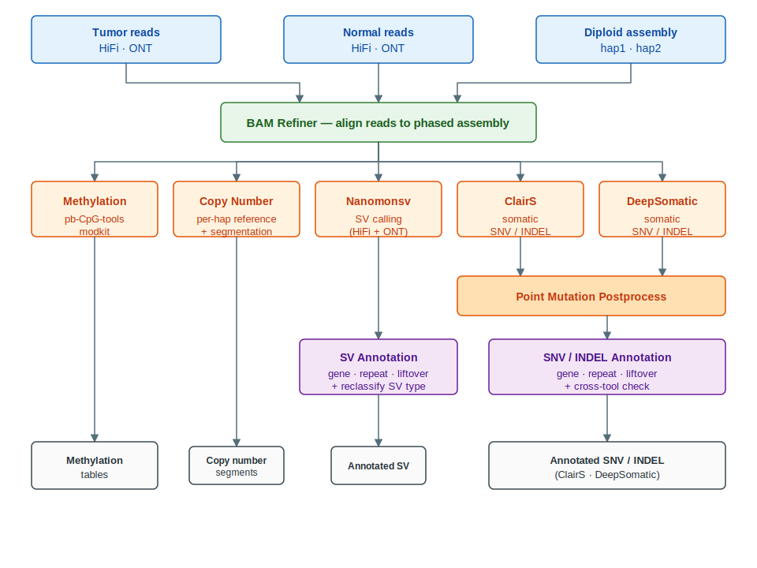

# Workflow

This page describes how PRCGAP is structured internally: the modules, their dependencies, the rule files that wire them together, and the output directory layout. The figure below gives the bird's-eye view; the **per-step descriptions** that follow walk through every block in the same top-to-bottom order.

## Workflow overview



> The figure above is a hand-curated, high-level summary — each rectangle corresponds to a module group rather than a single Snakemake rule. To inspect the full rule-level DAG for a specific configuration, run snakemake with `--rulegraph` (rule-only view) or `--dag` (per-sample / per-chromosome view; much larger) and pipe to Graphviz:
>
> ```bash
> snakemake \
>     --snakefile /path/to/PRCGAP/workflow/snakefile \
>     --configfile /path/to/config.yaml \
>     --directory /path/to/output \
>     --rulegraph | dot -Tsvg > prcgap_rulegraph.svg
> ```

## Per-step description

The workflow has three layers — **(A) BAM refinement** (the foundation), **(B) per-tumor analysis modules** (methylation, copynumber, SV, point mutations) which all consume the refined BAMs, and **(C) annotation leaves** which consume the postprocessed callsets.

### 1. BAM Refiner

**Scope:** per sample, per seqtype (HiFi / ONT). **Rule file:** `bam_refiner.smk`.

Aligns tumor and normal reads to the phased de novo assemblies (`assembly_hap1`, `assembly_hap2`) and emits one refined BAM per `sample × seqtype`. Every downstream module consumes these BAMs, so this step is the foundation of the DAG.

### 2. Methylation

**Scope:** per sample, per seqtype. **Rule file:** `methylation.smk`.

Methylation calling on the refined BAMs. HiFi reads are processed with `pb-CpG-tools`; ONT reads with `modkit`. Output is the per-CpG / per-position methylation table for each sample × seqtype.

### 3. Copy Number

**Scope:** per tumor. **Rule file:** `copynumber.smk`.

Builds per-haplotype reference tables (used later by `reclassify_sv`) and produces the segmented copy-number callset.

### 4. Nanomonsv pipeline (SV calling)

**Scope:** per tumor, internally split per seqtype, then merged. **Rule file:** `nanomonsv.smk`.

The pipeline runs `parse → get → postprocess → insert classify → connect` independently for HiFi and ONT, then merges the two callsets:

- `parse` and `get` (tumor + normal) extract candidate SVs from refined BAMs.
- `postprocess` filters and annotates.
- `insert classify` types insertion events.
- `connect` joins fragmented SV calls.
- `HiFi/ONT merge` produces the unified per-tumor SV table.

### 5. Point mutation calling — ClairS

**Scope:** per tumor. **Rule file:** `clairs.smk`.

Somatic SNV / INDEL calling against the personalized reference, producing the raw ClairS VCF.

### 6. Point mutation calling — DeepSomatic

**Scope:** per tumor. **Rule file:** `deepsomatic.smk`.

The same role as ClairS, run independently. The two callsets stay separate through post-processing and are cross-checked during annotation (`other` step in §9).

### 7. Point mutation post-processing

**Scope:** per tumor, per tool. **Rule files:** `clairs.smk`, `deepsomatic.smk` (postprocess rules).

Both ClairS and DeepSomatic raw VCFs go through `point_mutation_postprocess`, which performs realignment, pileup, and haplotype-aware refinement. Output is `<tool>_post/<tumor>/<tumor>.haplotyped.bed` together with the postprocessed VCF.

### 8. SV annotation + reclassification

**Scope:** per tumor, per seqtype. **Rule file:** `annotate_sv.smk` (+ shared `gff_to_bed`).

- `prep_sv` — filters the per-seqtype Nanomonsv insert-classified table to PASS calls and extracts a breakpoint BED.
- `coordconv_sv_{grch38,chm13}` — lifts the breakpoint BED via the configured chain files (each step is skipped if its chain is empty).
- `annotate_sv_main` — adds gene / RepeatMasker / size / kmer ratio / centromere / segdup / misassembly / cross-seqtype / gnomAD columns to the PASS table.
- `reclassify_sv` — combines the HiFi and ONT annotated tables for a tumor and uses the per-haplotype copynumber reference tables (from §3) to reclassify inter-contig SV directions on a CHM13-normalized basis. Both HiFi and ONT reclassified outputs are emitted.

All gene annotation derives from a single tabix-indexed liftoff GFF; the `gff_to_bed` rule produces the SV-specific gene BED on the fly.

### 9. SNV / INDEL annotation

**Scope:** per tumor, per tool (clairs / deepsomatic), per mode (snv / indel). **Rule file:** `annotate_mut.smk`.

- `mut_vcf_index` — re-bgzips and tabix-indexes the postprocessed VCF (clairs_postprocess_prepare concatenates SNV+INDEL records as plain gzip; deepsomatic_postprocess_prepare copies the raw VCF), producing a single tabix-ready form that both `bed2vcf.py` and the `other` cross-tool check can consume via `pysam.TabixFile`.
- `prep_mut` — splits the postprocessed `<tool>_post/<tumor>/<tumor>.haplotyped.bed` into separate 14-column SNV and INDEL BEDs (no header) — the exact input format expected by coordconv (SNV) and `bed2vcf.py` (INDEL).
- **SNV liftover:** `coordconv_snv_{grch38,chm13}` lifts coordinates directly.
- **INDEL liftover:** `bed2vcf_indel` constructs a per-tool INDEL VCF, `indel_hap_reference` concatenates and indexes the hap1+hap2 FASTA (used as the source reference), and `liftvcf_indel_{grch38,chm13}` performs the allele-aware transanno lift.
- `annotate_mut_main` — runs the per-tool / per-mode annotation chain in a single shell wrapper (`scripts/annotate/annotate_mut.sh`): `add_lift_coords → gene → rmsk → size → misa → cen → segdup → other → check_homozygous → gnomad`. The `other` step cross-checks against the *other* tool's tabix-indexed VCF (clairs ↔ deepsomatic).

## Rule file map

PRCGAP's Snakemake rules live under `PRCGAP/workflow/rules/`. The workflow is composed by importing modular rule files:

| File | Role |
|------|------|
| `commons.smk` | Shared utilities, sample sheet loading, helper functions |
| `process.smk` | Top-level imports tying the rule files together |
| `bam_refiner.smk` | Read alignment to phased de novo assemblies (per sample, per seqtype) |
| `methylation.smk` | Methylation calling (HiFi: pb-CpG-tools; ONT: modkit) |
| `copynumber.smk` | Copy number profiling |
| `nanomonsv.smk` | Nanomonsv parse / get / insert classify / postprocess / connect / merge |
| `clairs.smk` | ClairS somatic variant calling and post-processing |
| `deepsomatic.smk` | DeepSomatic somatic variant calling and post-processing |
| `annotate_sv.smk` | SV annotation (`prep_sv`, `coordconv_sv_*`, `annotate_sv_main`, `reclassify_sv`) + the shared `gff_to_bed` rule |
| `annotate_mut.smk` | SNV / INDEL annotation (`mut_vcf_index`, `prep_mut`, `coordconv_snv_*`, `bed2vcf_indel`, `indel_hap_reference`, `liftvcf_indel_*`, `annotate_mut_main`) |

Tool-specific wrapper scripts live alongside in `PRCGAP/workflow/scripts/`, and JSON Schemas for validating `config.yaml` and `samplesheet.tsv` live in `PRCGAP/workflow/schemas/`. All annotation rules run inside the single `annotation` Singularity image (pysam + samtools + coordconv + transanno + bgzip/tabix).

## Output directory layout

All paths are relative to the run directory (`--directory`):

```
output/
├── bam_refiner/{sample}/{seqtype}/                              # Refined BAMs per sample × seqtype
├── methylation/{sample}/{seqtype}/                              # Methylation calls per sample × seqtype
├── copynumber/{tumor}/                                          # Copy number results per tumor
├── nanomonsv/{seqtype}/                                         # Per-seqtype SV outputs (HiFi or ONT)
├── nanomonsv/{tumor}.*.merged.txt                               # Merged HiFi/ONT SV calls per tumor
├── clairs/{tumor}/                                              # ClairS raw calls
├── clairs_post/{tumor}/                                         # ClairS post-processed calls
├── deepsomatic/{tumor}/                                         # DeepSomatic raw calls
├── deepsomatic_post/{tumor}/                                    # DeepSomatic post-processed calls
├── annotate_common/liftoff.gene.bed.gz{,.tbi}                   # Shared liftoff-derived gene BED (built from --gff-file)
├── annotate_sv/{tumor}/{seqtype}/                               # Per-tumor / per-seqtype SV annotation workspace
│   ├── workspace/                                               # Intermediate prep / coordconv BEDs
│   └── {tumor}.PRCGAP.nanomonsv_results.annotated.txt           # Final per-seqtype annotated SV table
├── annotate_sv/{tumor}/{tumor}.{seqtype}.PRCGAP.nanomonsv_results.reclassified.txt   # Reclassified SV table (one per seqtype)
├── annotate_{snv,indel}/{tumor}/{tool}/                         # Per-tumor / per-tool / per-mode mutation annotation
│   ├── workspace/                                               # coordconv (SNV) / bed2vcf + transanno (INDEL) intermediates
│   └── {tumor}.{tool}.{snv,indel}.annotated.txt                 # Final annotated SNV / INDEL table
└── logs/                                                        # Per-rule log files
```

`{seqtype}` is `hifi` or `ont`; `{tool}` is `clairs` or `deepsomatic`; `{tumor}` is the sample name of the tumor sample for that pair.

## Where to look when something goes wrong

- Snakemake driver logs: `.snakemake/log/`
- Per-rule logs: `output/logs/<module>/<sample>/...`
- Cluster job stderr/stdout: depends on profile (`PRCGAP/profile/uge/` writes via `qsub_submit.sh`; `PRCGAP/profile/slurm/` via `slurm_submit.sh`).
- Validation errors from `config.yaml` / `samplesheet.tsv`: refer to the schemas in `PRCGAP/workflow/schemas/`.

For the practical command sequence and a worked example, see [Example.md](./Example.md).
